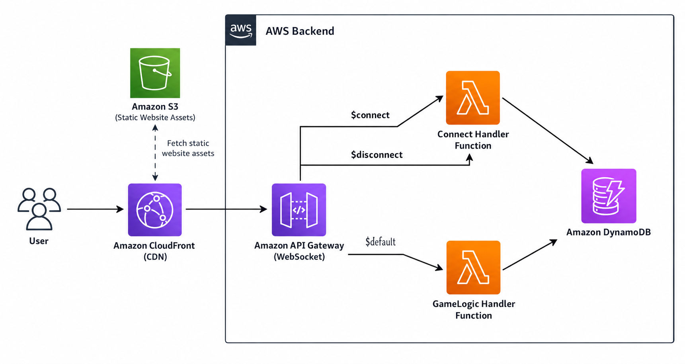

# 🎯 Guess The Number — Real-Time Multiplayer

A real-time, browser-based multiplayer number guessing game powered by **React**, **AWS WebSockets**, and a fully **serverless backend**. Create a room, share the code with friends, and compete across three unique game modes — all from your browser, no sign-up required.

---

## ✨ Features

- **Instant Multiplayer** — Create or join rooms using a 4-letter code. No accounts, no friction.
- **3 Game Modes** — Race, Proximity Hints, and Elimination, each with distinct mechanics.
- **Real-Time WebSockets** — Bidirectional communication via AWS API Gateway WebSocket API.
- **Rich Animations** — GSAP floating numbers, Framer Motion page transitions, glassmorphism UI, and cinematic game-over reveals.
- **Lobby System** — Host controls for mode selection, in-lobby rules modals, and player management.
- **Rematch & Replay** — Play again instantly or return to the lobby to switch modes.

---

## 🎮 Game Modes

### 🏁 Race
All players guess **simultaneously**. Everyone shares the same secret number. Hints (`Higher` / `Lower`) are **private** — your opponents can't see your progress. First to guess correctly wins.

### 🌡️ Proximity Hints
**Turn-based** guessing with a twist. Instead of `Higher` or `Lower`, the live feed reveals how close each guess is using temperature hints:

| Hint | Distance from Target |
|---|---|
| 🌋 **Boiling** | Within 5 |
| 🔥 **Hot** | Within 15 |
| ☀️ **Warm** | Within 30 |
| 🧊 **Cold** | Within 50 |
| ❄️ **Freezing** | More than 50 away |

Players must deduce the answer by cross-referencing everyone's temperature hints — a multiplayer logic puzzle.

### 💀 Elimination
Each round, every player makes **one blind guess** — no hints during the round. Once everyone locks in, the target number is revealed. The player whose guess was **furthest** from the target is eliminated. Rounds repeat until only one survivor remains, crowned with a cinematic 3-second countdown animation.

---

## 🏗️ Architecture




## 🛠️ Tech Stack

### Frontend
| Technology | Purpose |
|---|---|
| **React 18** | UI framework |
| **Vite 5** | Build tool & dev server |
| **Tailwind CSS 3** | Utility-first styling |
| **Framer Motion** | Page transitions & micro-animations |
| **GSAP** | Landing page floating number animations |
| **DOMPurify** | XSS sanitization for user-generated content |

### Backend
| Technology | Purpose |
|---|---|
| **AWS API Gateway v2** | WebSocket API with rate limiting (50 req/s) |
| **AWS Lambda** (Node.js 24.x) | Serverless game logic & connection management |
| **Amazon DynamoDB** | On-demand game state & connection storage |
| **AWS CDK v2** | Infrastructure as Code (TypeScript) |

### CI/CD & Hosting
| Technology | Purpose |
|---|---|
| **GitHub Actions** | Automated build & deploy on push to `main` |
| **Amazon S3** | Static frontend hosting |
| **Amazon CloudFront** | Global CDN distribution |

---

## 🚀 Getting Started

### Prerequisites
- **Node.js** ≥ 20.x
- **npm** ≥ 9.x
- An **AWS Account** with the backend resources deployed (see [Backend Setup](#backend-setup))

### Frontend Setup (Local Development)

1. **Clone the repository:**
   ```bash
   git clone https://github.com/sarkhelranit-source/Guess-The-Number.git
   cd Guess-The-Number
   ```

2. **Install dependencies:**
   ```bash
   npm install
   ```

3. **Create a `.env` file** in the project root:
   ```env
   VITE_WS_URL=wss://YOUR_API_ID.execute-api.us-east-1.amazonaws.com/production
   ```

4. **Start the dev server:**
   ```bash
   npm run dev
   ```

5. Open your browser to `http://localhost:5173` and start playing!

---

### Backend Setup

The backend infrastructure consists of two DynamoDB tables, two Lambda functions, and a WebSocket API Gateway. You can deploy it in one of two ways:

#### Option A: Manual Setup (AWS Console)
Create the following resources manually in the AWS Console:

1. **DynamoDB Tables:**
   - `ConnectionsTable` — Partition key: `connectionId` (String)
   - `GamesTable` — Partition key: `roomId` (String)
   - Both using **On-Demand** billing mode

2. **Lambda Functions** (Node.js 24.x runtime):
   - `ConnectHandlerFunction` — Paste code from `backend/src/handlers/connect.mjs`
   - `GameLogicHandlerFunction` — Paste code from `backend/src/handlers/gameLogic.mjs`

3. **Environment Variables** on each Lambda:
   | Lambda | Variable | Value |
   |---|---|---|
   | ConnectHandler | `CONNECTIONS_TABLE_NAME` | `ConnectionsTable` |
   | GameLogicHandler | `CONNECTIONS_TABLE_NAME` | `ConnectionsTable` |
   | GameLogicHandler | `GAMES_TABLE_NAME` | `GamesTable` |

4. **WebSocket API Gateway:**
   - Route selection expression: `$request.body.action`
   - `$connect` → ConnectHandlerFunction
   - `$disconnect` → ConnectHandlerFunction
   - `$default` → GameLogicHandlerFunction
   - Deploy to a `production` stage

5. **IAM Permissions:**
   - Attach `AmazonDynamoDBFullAccess` (or granular DynamoDB permissions) to both Lambda roles
   - Attach `AmazonAPIGatewayInvokeFullAccess` to both Lambda roles

#### Option B: AWS CDK Deployment
```bash
cd backend
npm install
npx cdk bootstrap   # First time only
npx cdk deploy
```
The WebSocket URL will be printed to your terminal after deployment.

#### Updating Lambda Code
When you modify the TypeScript handlers, bundle them for the AWS Console:
```bash
npx esbuild backend/src/handlers/gameLogic.ts --bundle --platform=node --target=node20 --external:@aws-sdk/* --outfile=backend/dist/gameLogic.mjs --format=esm

npx esbuild backend/src/handlers/connect.ts --bundle --platform=node --target=node20 --external:@aws-sdk/* --outfile=backend/dist/connect.mjs --format=esm
```
Then copy the output from the `backend/dist/` files into the AWS Lambda Console editor and click **Deploy**.

---

## 🚢 Deployment (CI/CD)

The project uses **GitHub Actions** to automatically build and deploy the React frontend on every push to `main`.

### Required GitHub Secrets

| Secret | Description |
|---|---|
| `VITE_WS_URL` | WebSocket API URL (`wss://...`) |
| `S3_BUCKET_NAME` | S3 bucket for frontend hosting |
| `CLOUDFRONT_DIST_ID` | CloudFront distribution ID |
| `AWS_REGION` | AWS region (e.g., `us-east-1`) |
| `AWS_ACCESS_KEY_ID` | IAM access key with S3/CloudFront permissions |
| `AWS_SECRET_ACCESS_KEY` | Corresponding secret key |

The pipeline runs `npm run build`, syncs the `dist/` folder to S3, and invalidates the CloudFront cache.

---

## 🔒 Security

| Measure | Description |
|---|---|
| **Input Sanitization** | Player names are stripped of HTML tags and special characters on the backend |
| **DOMPurify** | All server-received text is sanitized before rendering in the UI |
| **Payload Validation** | Guesses are strictly validated as integers between 1–100 |
| **Token Stripping** | Sensitive `connectionId` and `hostId` fields are scrubbed from all public broadcasts |
| **Environment Variables** | WebSocket URL loaded from `.env`, never hardcoded in source |
| **Rate Limiting** | API Gateway throttled to 50 req/s with 100 burst limit |
| **Env Validation** | Lambda functions crash gracefully if required env vars are missing |

---

## 💰 Cost Model

This project is 100% serverless with pay-per-request pricing. **If no one is playing, the cost is $0.00.**

| Service | Always Free Tier | Estimated Monthly Cost |
|---|---|---|
| AWS Lambda | 1M requests/month | ~$0.00 |
| DynamoDB | 25 GB + 2.5M read/write | ~$0.00 |
| CloudFront | 1 TB transfer | ~$0.00 |
| API Gateway | Pay-per-message | < $0.01 |
| S3 | 5 GB storage | < $0.01 |

> For casual use with friends, the entire project runs comfortably within the AWS Free Tier.

---

## 📄 License

This project is open source. Feel free to fork, modify, and use it for your own purposes.
